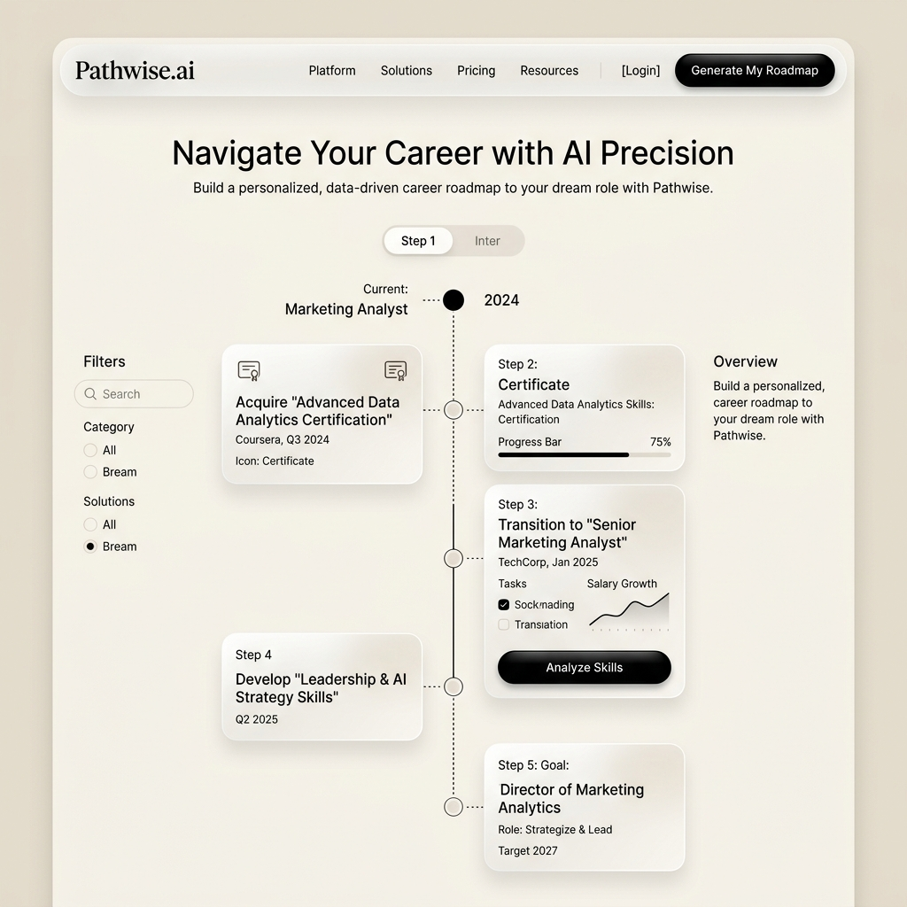

# AI Career Roadmap Generator

A premium, production-ready full-stack career roadmap generator inspired by the high-end, minimal beige aesthetics of **Margdarshak AI** and modern SaaS startups. 

This application compiles structured learning timelines, progressive milestones, and hands-on project briefs tailored dynamically by career goals and experience level.

---

## 🎨 Design Aesthetics & Theme
- **Theme**: Cream/Beige Minimalist (Background: `#FDFBF7`, Card: `#F5F2EB`, Borders: `#D8D2C4`)
- **Typography**: Bold, clean type layout utilizing the Google Font `Outfit`
- **CTA Actions**: Glossy black hover-scaled buttons
- **Interactions**: Glassmorphism cards, micro-animations using Framer Motion, shimmer skeletons during loads, and custom notification toasts.

---

## 📸 Interface Preview


---

## ⚡ Tech Stack

### Frontend
- **Framework**: Next.js 14 (JavaScript, App Router)
- **Styling**: Tailwind CSS & Vanilla variables
- **Animations**: Framer Motion
- **Icons**: Lucide React
- **HTTP Client**: Axios & React Hot Toast

### Backend
- **Runtime**: Node.js & Express.js
- **Database**: MongoDB Atlas
- **Mongoose ORM**: Schema validations & indexing
- **Configuration**: Dotenv & CORS middlewares

---

## 📂 Project Directory Structure

```
ai-career-roadmap/
├── frontend/                     # Next.js App Router Client
│   ├── src/
│   │   ├── app/
│   │   │   ├── history/
│   │   │   │   └── page.js       # Saved archives page
│   │   │   ├── globals.css       # Custom variables & glass styles
│   │   │   ├── layout.js         # Shell configuration, fonts, toaster
│   │   │   └── page.js           # Dashboard, Hero, Form & Live Preview
│   │   ├── components/
│   │   │   ├── Navbar.jsx        # Glassmorphic top navigation
│   │   │   ├── Hero.jsx          # Interactive animated SaaS header
│   │   │   ├── RoadmapForm.jsx   # Input fields & validation handler
│   │   │   ├── Timeline.jsx      # Phase/Project timeline renderer
│   │   │   ├── HistoryCard.jsx   # Grid archive card
│   │   │   ├── Loader.jsx        # Smart shimmer loader skeleton
│   │   │   └── Footer.jsx        # Minimal branding footer
│   │   └── services/
│   │       └── api.js            # Axios request mapping
│   ├── tailwind.config.js
│   └── package.json
│
└── backend/                      # Node.js/Express Server API
    ├── config/
    │   └── db.js                 # MongoDB connector
    ├── controllers/
    │   └── roadmapController.js  # Generate, Fetch, & Delete controllers
    ├── models/
    │   └── Roadmap.js            # Mongoose Schema definition
    ├── routes/
    │   └── roadmap.js            # Router endpoints
    ├── utils/
    │   └── roadmapGenerator.js   # Custom progressive roadmap builder database
    ├── .env.example
    └── server.js
```

---

## 🚀 Installation & Setup

### Prerequisites
- Node.js (v18.x or higher)
- npm (v9.x or higher)
- MongoDB Atlas account (for history storage)

### Step 1: Clone and Configure Backend
1. Navigate into the `backend/` folder:
   ```bash
   cd backend
   ```
2. Install server-side dependencies:
   ```bash
   npm install
   ```
3. Create a `.env` file from the template:
   ```bash
   cp .env.example .env
   ```
4. Define your connection parameters in `.env`:
   ```env
   PORT=5000
   MONGODB_URI=your_mongodb_atlas_connection_string
   CLIENT_ORIGIN=http://localhost:3000
   ```
   > ⚠️ **Note**: If `MONGODB_URI` is left blank, the server automatically starts in **in-memory fallback mode**. This lets you run the app locally without database failures!
5. Start the backend developer server:
   ```bash
   npm run dev
   ```

### Step 2: Configure Frontend Client
1. Open a new terminal and navigate to the `frontend/` folder:
   ```bash
   cd frontend
   ```
2. Install frontend dependencies:
   ```bash
   npm install
   ```
3. Start the Next.js development server:
   ```bash
   npm run dev
   ```
4. Open your browser and navigate to: [http://localhost:3000](http://localhost:3000)

---

## 📡 API Routing Contract

All routes are prefixed with `/api`.

| HTTP Method | Route | Description | Payload Schema / Request Params |
|:---|:---|:---|:---|
| **POST** | `/api/roadmap/generate` | Analyzes input, maps learning modules, saves to DB, and returns the roadmap. | `{ "role": "Frontend", "skills": ["HTML"], "experienceLevel": "Beginner" }` |
| **GET** | `/api/roadmaps` | Returns all previously saved roadmaps sorted by creation date. | None |
| **DELETE** | `/api/roadmap/:id` | Deletes a roadmap from the history archive. | `id` (MongoDB object ID) |

---

## 📦 Deployment Instructions

### Frontend (Vercel Ready)
1. Commit and push the workspace changes to your GitHub repository.
2. Log in to [Vercel](https://vercel.com/) and click **Add New Project**.
3. Select your repository.
4. Set the **Root Directory** as `frontend`.
5. In Environment Variables, configure:
   - `NEXT_PUBLIC_API_URL` = `https://your-backend-service-url.onrender.com/api`
6. Click **Deploy**.

### Backend (Render Ready)
1. Log in to [Render](https://render.com/).
2. Select **New Web Service** and link your repository.
3. Configure the settings:
   - **Root Directory**: `backend`
   - **Build Command**: `npm install`
   - **Start Command**: `npm start`
4. Add the following Environment Variables under the **Environment** tab:
   - `PORT` = `5000`
   - `MONGODB_URI` = `your_mongodb_atlas_uri`
   - `CLIENT_ORIGIN` = `https://your-vercel-frontend-url.vercel.app`
   - `NODE_ENV` = `production`
5. Click **Deploy Web Service**.
